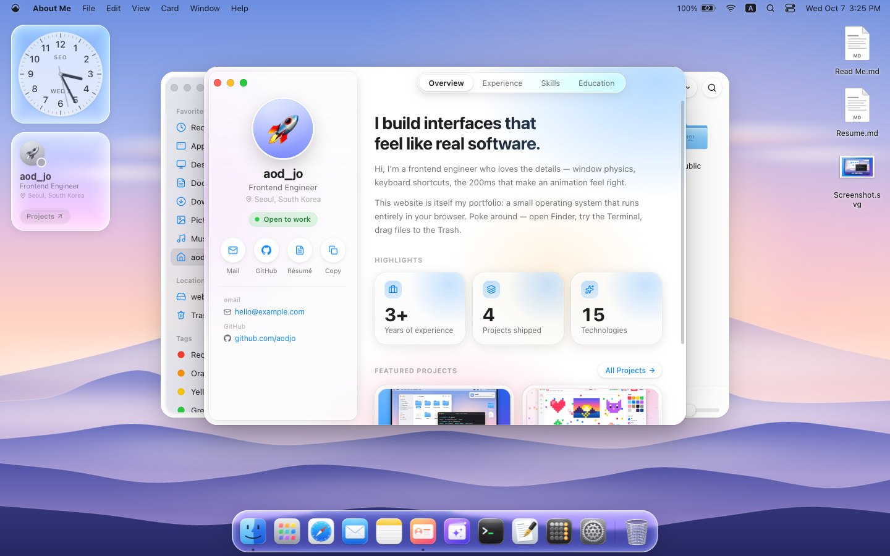
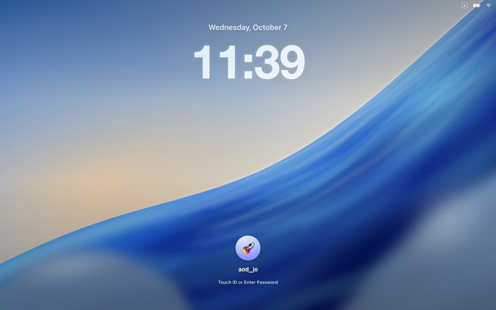
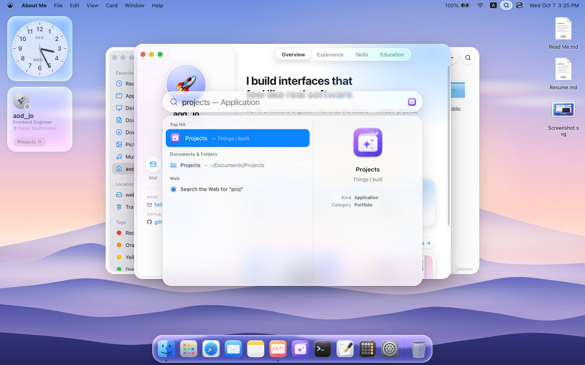
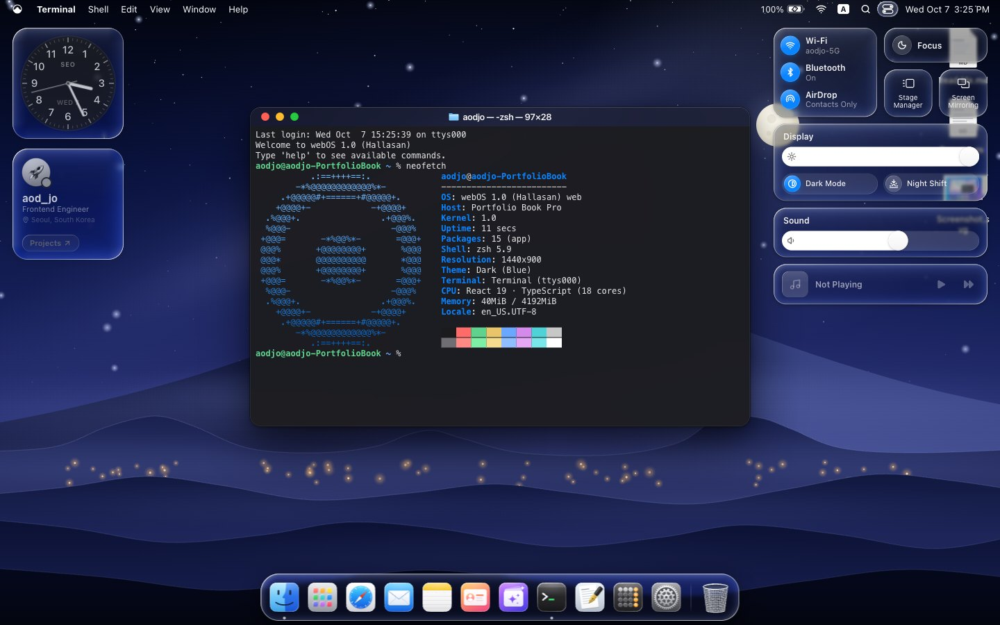

# webOS

A macOS-style operating system that runs entirely in the browser — built as a developer portfolio.
Real window management, a persistent virtual file system, a zsh-like terminal and a dozen apps that all share one kernel, dressed in a Liquid Glass look.

[한국어](#한국어)



| Lock screen | Spotlight | Dark mode & Control Center |
| --- | --- | --- |
|  |  |  |

## Features

- **Window manager** — drag, resize from every edge, snap to halves or fill, minimize into the Dock, Mission Control (F3), ⌥Tab app switcher, Show Desktop (F11).
- **Virtual file system** — shared by every app and saved in IndexedDB: create, rename, move, copy, trash and restore files; import files by dropping them in, download them back.
- **Apps** — Finder (icon / list / column / gallery views, Quick Look, Get Info), Terminal (pipes, redirection, globbing, history, tab completion, `neofetch`), TextEdit, Preview, Notes, Safari, Mail, Calculator, Activity Monitor, System Settings, Minesweeper.
- **Linux** — a real Alpine Linux PC emulated in the browser with [v86](https://github.com/copy/v86), with Python, vim and git. It resumes from a booted snapshot and fetches files on demand, so it only costs bandwidth when opened. It has no network and nothing is saved. Rebuild the image with `scripts/vm/build.sh` (Docker) and `node scripts/vm/build-state.mjs`.
- **Portfolio apps** — About Me, Projects and a first-run Tips tour, all generated from one data file.
- **System** — boot, login and lock screens, sleep / restart / shut down, menu bar with real menus and shortcuts, Control Center, Notification Center, Spotlight (apps, files, math), Launchpad, desktop widgets.
- **Liquid Glass** — translucent glass with a thin rim light, modelled on macOS 26: Control Center and widgets switch between white and dark content depending on what lies behind them, and the lock screen clock is milky glass over the wallpaper. On Chromium browsers an SVG filter adds real edge refraction (Dock, Spotlight, menus, Control Center, widgets).
- **English / 한국어** UI switchable at runtime, light / dark / auto appearance, accessibility options (Reduce Motion, Reduce Transparency), phone-friendly layout.

## Getting started

```bash
npm install
npm run dev        # http://localhost:5173
npm test           # unit and component tests (Vitest)
npm run build      # static site in dist/
```

Requires Node.js 22.12 or later.

## Make it yours

Edit **`src/data/portfolio.ts`** — name, role, bio, contact links, skills, experience, education and projects. Everything else (About Me, Projects, Mail, Terminal commands, Spotlight and the project files in Finder) is generated from it. Every text field accepts a plain string or `{ en, ko }`.

- Avatar: replace `public/avatar.jpg` and point `owner.avatar` at it.
- Project covers: `public/projects/*.svg`, referenced by each project's `cover`.
- Wallpapers: `public/wallpapers/`, listed in `src/kernel/wallpapers.ts`. The default "Flow" picture is drawn by `scripts/wallpapers/flow.html` and saved as JPEGs by `scripts/wallpapers/render.js` (a Playwright snippet, run with the dev server up).

Visitors' changes (files, settings) are stored in their own browser; when you change the portfolio data, returning visitors get the new content merged in and keep their own files.

## Deploying

`npm run build` produces a static site in `dist/` with no server-side code. Serve it from the **root of a domain** (Cloudflare Pages, Netlify, Vercel, a custom domain on GitHub Pages…): assets are referenced with absolute paths such as `/wallpapers/…`.

## Tech

React 19 · TypeScript · Vite · Zustand · idb-keyval · marked · lucide-react. No UI framework — every component and the glass material are hand-written CSS Modules.

```
src/kernel/    OS core: file system, window manager, menus & shortcuts, dialogs, notifications, i18n
src/shell/     menu bar, Dock, windows, desktop, boot / login / lock screens
src/apps/      one folder per app (lazy-loaded)
src/components shared controls, Markdown, Liquid Glass (Glass.tsx, liquidGlass/)
src/data/      portfolio.ts — the file you edit
```

## Browser support

Latest Chrome, Edge, Safari and Firefox. The refracting glass filter needs `backdrop-filter: url()` (Chromium); other browsers show the same glass without refraction.

## Disclaimer

This is an independent fan-made project inspired by macOS. It is not affiliated with or endorsed by Apple Inc. or LG Electronics. macOS, Finder, Safari and related names are trademarks of Apple Inc.; webOS is a trademark of LG Electronics. All artwork in this repository (icons, wallpapers, covers) is original.

## License

[MIT](LICENSE). The Linux app bundles third-party software under its own licenses: v86 (BSD-2-Clause), SeaBIOS and its VGA BIOS in `public/vm` (LGPL-3.0) and the Alpine Linux packages in the disk image (their respective licenses).

---

## 한국어

브라우저에서 동작하는 macOS 스타일 운영체제이자 개발자 포트폴리오입니다. 실제 창 관리, IndexedDB에 저장되는 가상 파일시스템, zsh 스타일 터미널, 하나의 커널을 공유하는 십여 개의 앱을 macOS 26의 Liquid Glass 디자인으로 구현했습니다. 제어 센터와 위젯은 뒤에 있는 내용에 따라 흰 글씨와 어두운 글씨를 오가고, 잠금 화면 시계는 배경이 비치는 우윳빛 유리로 그립니다.

### 실행

```bash
npm install
npm run dev        # http://localhost:5173
npm test
npm run build      # dist/ 에 정적 사이트 생성
```

### 내 포트폴리오로 바꾸기

**`src/data/portfolio.ts` 한 파일만 수정하면 됩니다.** 이름·직함·소개·연락처·기술·경력·학력·프로젝트가 About Me, Projects, 메일, 터미널 명령어, Spotlight, Finder 안의 프로젝트 파일에 자동으로 반영됩니다. 모든 문구는 문자열 또는 `{ en, ko }`로 쓸 수 있습니다.

- 아바타: `public/avatar.jpg`를 교체하고 `owner.avatar`가 그 파일을 가리키게 합니다
- 프로젝트 커버: `public/projects/*.svg`
- 배경화면: `public/wallpapers/` (목록은 `src/kernel/wallpapers.ts`). 기본 배경 "Flow"는 `scripts/wallpapers/flow.html`이 그리고 `scripts/wallpapers/render.js`(Playwright 스니펫, 개발 서버 실행 중에 사용)가 JPEG로 저장합니다.

방문자가 만든 파일과 설정은 각자의 브라우저에 저장됩니다. 포트폴리오 데이터를 바꾸면 재방문자에게 새 내용이 병합되고 방문자 파일은 유지됩니다.

### 배포

`npm run build` 결과물(`dist/`)은 서버 코드가 없는 정적 사이트입니다. **도메인 루트**에서 서비스해야 합니다(Cloudflare Pages, Netlify, Vercel, 커스텀 도메인을 연결한 GitHub Pages 등). 리소스를 `/wallpapers/…` 같은 절대 경로로 참조하기 때문입니다.

### 브라우저 지원

최신 Chrome·Edge·Safari·Firefox. 유리 굴절 효과는 Chromium 계열에서만 보이고, 다른 브라우저에서는 굴절 없는 유리로 표시됩니다.

### 라이선스 및 고지

MIT 라이선스. Apple, LG전자와 무관한 개인 프로젝트이며 macOS·Finder·Safari는 Apple의, webOS는 LG전자의 상표입니다. 아이콘·배경화면·커버 이미지는 모두 직접 제작한 것입니다. Linux 앱에 포함된 v86(BSD-2-Clause), SeaBIOS(LGPL-3.0), Alpine Linux 패키지는 각자의 라이선스를 따릅니다.
